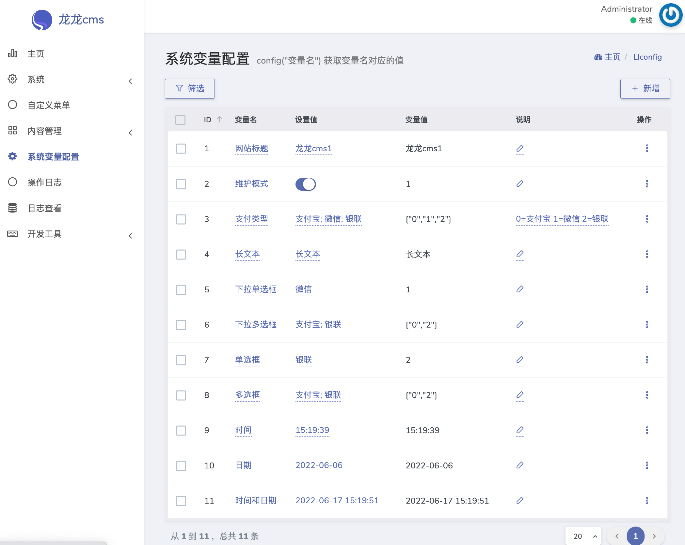

# 系统变量配置管理 Dcat Admin Extension

用于配置系统中各种的动态变量 设置值列为可编辑列 变量值为 config("变量名") 的值




!(images/README/image-20220605023743106.png)


# 安装

下载本项目的zip  然后在 `开发工具->扩展` 安装本扩展

# 卸载
把表 `llconfig` 删除即可默认点卸载会删除的 没删掉的话 自行删除

# 使用
界面在 `/admin/llconfig`

打开文件 `app/Providers/AppServiceProvider.php` 
加载变量配置
```php
use Ll\DcatConfig\LlConfig;


public function boot()
{
    if (Schema::hasTable('llconfig')) {
        LlConfig::load();
    }
}
```

# 获取变量值

```
dd(config("网站标题"));

```

