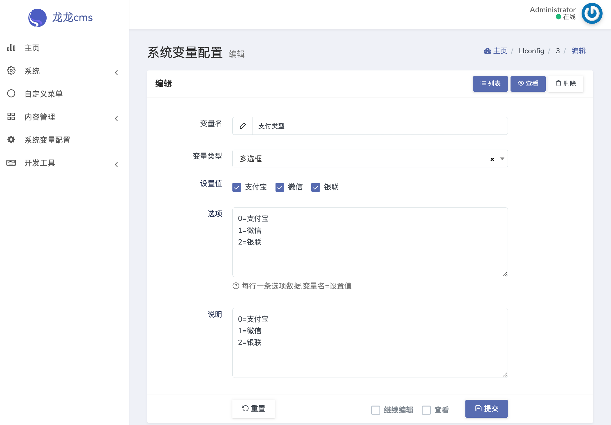

# 系统变量配置管理 Dcat Admin Extension

用于配置系统中各种的动态变量





# 使用

打开文件 `app/Providers/AppServiceProvider.php` 
加载变量配置
```php
use Ll\DcatConfig\LlConfig;


public function boot()
{
    if (Schema::hasTable('llconfig')) {
        LlConfig::load();
    }
}
```

# 获取变量值

```
dd(config("网站标题"));

```

